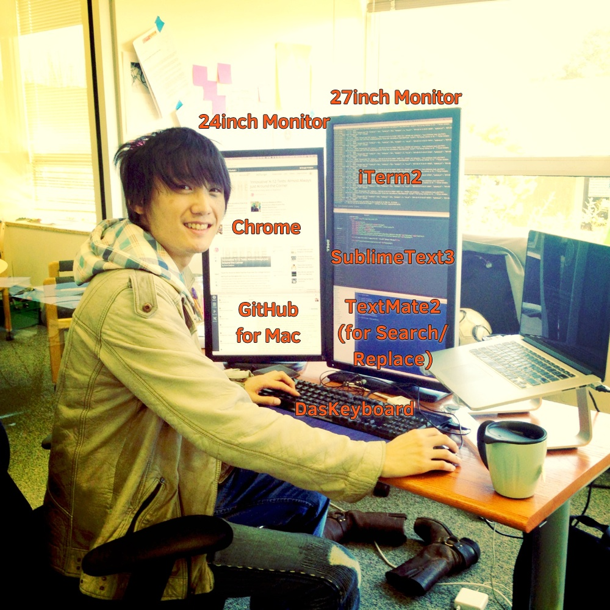

[EdSurge](http://www.edsurge.com) is looking for the second software engineer to join our team. If you're an engineer looking to get into edtech, please read on.

<!--break-->

Hi,

My name is Shu Uesugi, and I'm a designer at [EdSurge](https://www.edsurge.com/), a SF Bay Area based media startup in education technology (edtech) space. I'm looking for a software engineer to join our team.

If you...

* are a software engineer,
* have heard a lot about edtech recently (e.g. [Udacity launching the first ever online M.S. in CS program for < $7000](http://blog.udacity.com/2014/01/sebastian-thrun-worlds-first-massive.html)), and
* are interested in working at a *promising* edtech startup,

please read on.

## What We Do at EdSurge

[EdSurge](https://www.edsurge.com/) is on its way to becoming the best source of information in edtech. We have [a team of 14 people](http://about.edsurge.com/team), and more than half of us are journalists and education specialists. Every day we report, curate and analyze the products, companies and organizations building edtech.

Particularly in edtech, a great source of information turns out to be quite valuable (and therefore, monetizable). Why so? Well, Paul Graham [said](http://paulgraham.com/startupideas.html): "[best startup ideas] are something the founders themselves want." And from 37signals' book [Rework](http://www.amazon.com/ReWork-Change-Way-Work-Forever-ebook/dp/B002MUAJ2A): "The easiest, most straightforward way to create a great product or service is to make something *you* want to use."

However, in edtech, this usually doesn't happen. People who use software in schools are very different from the ones who build software. Each educator needs *information* to understand which software will be most effective for his/her situations, and each entrepreneur/developer/investor needs *information* to understand customers behind the classroom wall.

Also in edtech, the effectiveness of each software varies significantly based on users. Consider an app that teaches Algebra. It can work well for most schools, but it might not work in an urban school where most students are taking Algebra for the 3rd time. It might work well when teachers give feedback to each student every 10 minutes, but it might not work well in an 100% self-paced environment. As a result, purchasing decisions for edtech products can be tough to make--educators need some sort of a *recommendation system*, based on their teaching environments.

This is where EdSurge comes in. We help bridge the information gap among key players of edtech, so that each player can make smart decisions. Currently, in addition to our [main news product](https://www.edsurge.com/), we built a [database](https://www.edsurge.com/products/) of ~800 edtech products (written in AngularJS). Our goal in 2014 is to polish our database product and allow educators to participate on our site ([example](https://www.edsurge.com/p/classdojo/reviews)), which can serve as a basis to building a recommendation system of edtech software.

We believe that the key to achieving our goal is to invest in and give back to the edtech community. So EdSurge regularly holds events for educators and entrepreneurs--last year we held our biggest one at Computer History Museum in Moutain View, CA, where 600 educators and 30 companies attended ([photos](https://www.edsurge.com/guide/edsurge-tech-for-schools-summits)).

Our CEO Betsy Corcoran, an ex-Executive Editor at Forbes and award-winning writer for the Washington Post and Scientific American, is commited to making EdSurge a success. You can watch a 3 min video of her here:

<iframe src="//player.vimeo.com/video/70510094" width="500" height="281" frameborder="0" webkitallowfullscreen mozallowfullscreen allowfullscreen></iframe>

 You can also watch the video of the full EdSurge staff [here](http://www.youtube.com/watch?v=-Pj_TQxDT3w).

#### Who's Funding EdSurge?

We closed a $1.5M funding round in Feb 2014. [Read about it here](https://www.edsurge.com/n/2014-02-26-edsurge-wraps-up-funding-launching-new-initiatives).

## Engineering at EdSurge

In terms of hiring engineers, we have only two requirements: we're looking for an engineer such that, by having him/her in the team,

1. the awesomeness of our engineering team is increased sufficiently, and
2. the awesomeness of our company is increased sufficiently.

Below is a quick summary of our engineering culture. See if any of these click with you.

#### Process

We have a small product team at EdSurge--it's me (designer), [Agustin Vilaseca](http://www.linkedin.com/in/agustinvilaseca) (backend guy), and [Nick Punt](http://www.linkedin.com/in/nickpunt) (product guy). Each of us works on a few different projects, and for each project, we work with one or two education specialists at EdSurge. We try to follow cross-disciplinary collaboration detailed in the excellent [Lean UX](http://www.amazon.com/Lean-UX-Applying-Principles-Experience/dp/1449311652) book.

We use Scrum for project management (with [Trello](https://trello.com/)). We try to work [asynchronously](http://zachholman.com/posts/how-github-works-asynchronous/) by utilizing Google Docs, Hipchat, and [GitHub Flow](http://scottchacon.com/2011/08/31/github-flow.html). I'm a huge fan of the 37signals' new book [Remote](http://37signals.com/remote/), and we're open to discussion for potentially working from home part time/full time. We also peer-review every pull request.

#### Tech Stack

Heroku + Rails 3.2.x (currently upgrading to > 4.0) + PostgreSQL + MemCache. [Solr](http://lucene.apache.org/solr/) for fulltext search. AngularJS for our [edtech database product](https://www.edsurge.com/products/). [Redactor](http://imperavi.com/redactor/) for authoring content. Rspec for testing, devise for logins, and delayed_job for queuing. Uses [draper](https://github.com/drapergem/draper) heavily for presentation logic. Our SASS code follows [SMACSS](http://smacss.com/).

#### Open Source

We wouldn't be at where we are now without the power of open source, and our goal in 2014 is to give back to the open source community. For starters, this page you're looking at is [open sourced on GitHub](https://github.com/edsurge/careers.edsurge.com), and built with [Jekyll](http://jekyllrb.com/), [Poole](http://getpoole.com/), [Buttons](http://alexwolfe.github.io/Buttons/), and [Fitvids.js](http://fitvidsjs.com/).

#### Short Methods

I love writing short methods. Join me if you do, too! FYI: James Edward Gray II suggests that we should teach coding beginners to write small methods from day 1, on [Ruby Rogues Podcast Episode 131](http://rubyrogues.com/131-rr-how-to-learn/):

> When you’re learning to program, if one of the first things you learn is write small methods, how far will that get you? Pretty far, right? ... You don’t need to know why short methods are better to greatly benefit from writing short methods. If you do that, you will be better.

#### Learn about Edtech

We're probably the best company to join for engineers who want to learn about edtech. That's why I joined too. You'll get to learn from edtech experts in our team and attend edtech conferences (and get a lot of attention from educators; they'd be like, "omg you work at EdSurge!").

#### My Work Environment

## Working at EdSurge

Our office is at 1801 Murchison Drive, Burlingame, CA ([Google Maps](https://maps.google.com/maps?t=m&q=1801+Murchison+Drive%2C+Burlingame%2C+CA)). It's ~12 min walk from Millbrae Caltrain/BART station and equidistant from highway 101 and 280. Some commute from Berkeley/Oakland, some commute from Mission/Castro, and some commute from Redwood City/Menlo Park.

Parking is abundant, and since we're so close to SFO, many of us park our car at the office when we travel.

[Cafe Roma](http://www.cafferoma.com/) is located down the street for delicious coffee/lunch. We have a little kitchen and a fridge at our office.

Salary/equity is negotiable. We provide health, dental, and vision insurance plans.

## Apply

#### (UPDATE: 2/18/14)

We're currently only talking to engineers who've had some full-time industry experience in software engineering, preferably in a software startup.

Also, we're not looking to hire interns.

#### Cover Letter

Email me a cover letter and relevant links (GitHub profile/projects). If you're thinking: "Huh? Cover letter?"--please read DHH's post ["Forget the resume, kill on the cover letter"](http://37signals.com/svn/posts/1748-forget-the-resume-kill-on-the-cover-letter).

The cover letter *does not* need to be long. Be concise.

<a href="mailto:shu@edsurge.com" class="button button-rounded button-primary button-large">Email shu@edsurge.com</a>
<a href="http://about.edsurge.com/team" target="_blank" class="button button-rounded button-large">View EdSurge Team</a>

#### Interview Process

After reviewing your cover letter, I'll be your first (phone) interviewer. I won't give you any live-coding interviews because they don't work. [As to why, please read this article](http://css-tricks.com/interviewing-front-end-engineer-san-francisco/). On my interview, I like to ask what you're *geniunely* passionate about in your professional life, so I can determine if EdSurge can help you get to where you want to be. I also like to ask how you stay current.

If things go well, I'd like you to interview with our management team ([Betsy Corcoran, Nick Punt, Agustin Vilaseca, and Tyler McNally](http://about.edsurge.com/team)). If this goes well, then you'll be enrolled in our "trial period."

#### Trial Period: We Will Give You Paid Contract Work

We also believe in [hiring by auditions](http://blogs.hbr.org/2014/01/hire-by-auditions-not-resumes/) and [hiring for culture](http://joel.is/post/61468652377/what-no-one-talks-about-when-building-a-team-letting). That means we won't do coding interviews, but instead we'd like to give you a short, well-paid contract project before bringing you on for full time. That's how I was hired too. It was great because during my contract period, both EdSurge and I learned that we're good fit for each other.

You can do this "trial" work at night or over a weekend, so you don't have to leave your current job in the meantime. We'll give you a real task, which will likely involve building internal tools for us. The trial period should last for two to four weeks, but we're flexible about the details. FYI: my trial project was building the ["Events" feature](https://www.edsurge.com/e) on EdSurge, from backend to frontend.

Enough talk. My email is **shu@edsurge.com**. Would love to hear from you.

<a href="mailto:shu@edsurge.com" class="button button-rounded button-primary button-large">Email shu@edsurge.com</a>
<a href="http://about.edsurge.com/team" target="_blank" class="button button-rounded button-large">View EdSurge Team</a>

## PS: About Me

If you have any questions, email me or message me on [Twitter](https://twitter.com/chibicode). You can follow me too--I tweet about code a few times a day.

Just a little bit about my background: I graduated from Carnegie Mellon with a B.S. in Computer Science (2009) and Masters in Human-Computer Interaction (2010). Before EdSurge, I've worked at Palantir as a software engineer and Quora as a product designer. [My LinkedIn profile](http://www.linkedin.com/in/chibicode) is here and [my GitHub profile](https://github.com/chibicode) is here.

If you want to learn more about me, read my [blog post](https://medium.com/what-i-learned-building/fe6a2067d770), which somehow became the top 50 most read posts on Medium in August 2013.

Shu Uesugi, Designer

## PS: Welcome Ruby Weekly Readers!

[Ruby Weekly](http://rubyweekly.com/) by [Peter Cooper](https://twitter.com/peterc) is a fantastic newsletter.

<blockquote class="twitter-tweet" lang="en">
We are on Ruby Weekly. <a href="https://twitter.com/EdSurge">@EdSurge</a> is hiring engineers! <a href="http://t.co/s3KP9kYXrS">http://t.co/s3KP9kYXrS</a> <a href="http://t.co/GoTk8YzvEd">pic.twitter.com/GoTk8YzvEd</a>
&mdash; Shu Uesugi (@chibicode) <a href="https://twitter.com/chibicode/statuses/446673014826881024">March 20, 2014</a></blockquote>
