注意: 長文で、当たり前のことしか書いていません。あなたの時間の無駄になってもあしからず。

* Surfaceのビジョンは透き通っている
* Surfaceのデザインは透き通っていない

---

### Surfaceのビジョンは透き通っている

> 米マイクロソフト（MS）が自社ブランドのタブレット（多機能携帯端末）「Surface」を年内に発売する。ソフトウエア世界最大手のMSがハード（機器）を手がけるのはゲーム機や周辺機器を除けば異例だ。アップルやグーグルはスマートフォン（高機能携帯電話＝スマホ）やタブレットで急成長を遂げている。パソコンの存在感が薄れるなか、MSは自らタブレットを投入し、巻き返しを急ぐ。([日経新聞](http://www.nikkei.com/article/DGXDASDC19006_Z10C12A6FF2000/))

私は先週のSurface発表で一番よかったのはSurface自体ではなく、マイクロソフトのビジョンが明確になったことだと考えている。

[公式ページ](http://www.microsoft.com/surface/en/us/default.aspx)にある下の画像は、[ファイル名](http://www.microsoft.com/global/surface/en/us/publishingimages/new/hero.jpg)が`hero.jpg`となっている。だが、誰のためのヒーローなのか。ユーザーのヒーローではない。[広告](http://www.youtube.com/watch?v=dpzu3HM2CIo)には人の顔が0.1秒しか出てこない。Surfaceの開発を[知らされてなかった](http://jp.reuters.com/article/marketsNews/idJPTK816989520120620)、PCハードウェア企業のヒーローでもない。

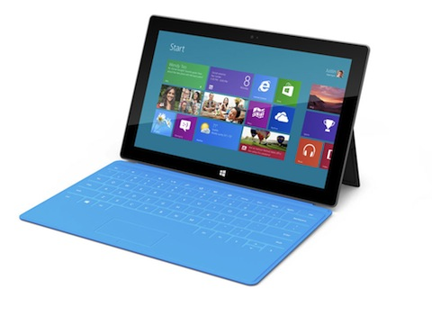

でもマイクロソフトにとってのヒーローと考えると、納得がいく。

タブレット市場をリードするアップルは、「タブレット」「PC」それぞれに対し「iOS」「Mac OS」という違うOSを提供し続けるつもりだ。アップルのCook社長も、[AllThingsD](http://allthingsd.com/20120529/cook-tablets-shouldnt-be-burdened-by-pc-legacy/)のインタビューで「私はタブレットとPCは別物だと考えている」と発言した。

それに対しマイクロソフトは、「タブレット」「PC」両方に「Windows 8」というひとつのOS、ひとつのUIを提供しようとしている。

マイクロソフトは、タブレットとPCの格差を無くすヒーロー役に、Surfaceを起用するつもりだ。発表イベントではSinofsky氏が「SurfaceはPCとして素晴らしいタブレットで、タブレットとして素晴らしいPCだ(12:02)」と言い、Ballmer社長も「SurfaceはPCでもあり、タブレットでもある(45:40)」と発言している。

<iframe width="480" height="270" src="http://www.youtube.com/embed/jozTK-MqEXQ" frameborder="0" allowfullscreen></iframe>

彼らがそう言える理由は、デザイナーのPanay氏が「奥さんの次に愛している(39:58)」取り外し可能なカバー兼キーボードある。広げたときはPC、畳んだときはタブレットだからだ。

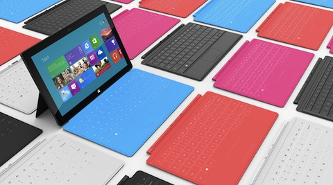

しかしSurfaceはそれ以上に、マイクロソフト「社員の」ヒーローになったと私は思う。Surfaceはマイクロソフト史上、一番多くの部署をつなげたかもしれない。発表ビデオでも、色んな分野の研究者、エンジニア、デザイナーがコラボした様子が描かれている(30:00)。

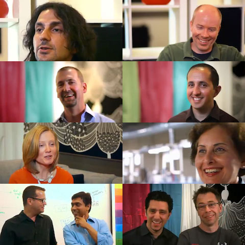

タブレット市場の遅れを取り戻すため、誰にも頼らずハードから小売まで垂直統合すると決めたマイクロソフトにとって、「社員がひとつになること」は一番重要なハードルだ。下の写真(撮影=私)はシリコンバレーに新しくできたマイクロソフトストアの様子だが、アップルストアの横に作られている。正面衝突するからには、マイクロソフトの販売員は、アップルの販売員と同じくらい、自社のビジョンを理解する必要がある。

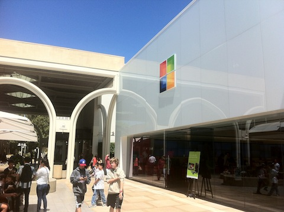

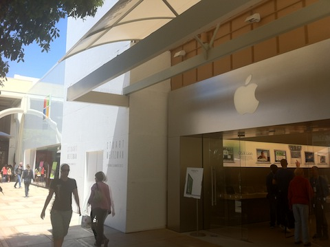

そして「タブレットとPCの融合」というビジョンの社員用説明書として、タブレットにもPCにもなれるSurfaceは最適だ。それを売る販売員も、マイクロソフトが何をしたいかが一目で分かる。

「ビジョンがわかりやすい製品を作らせて、社員をつなげる」という例のひとつに90年代後半のアップルがある。Jobsは帰還後、混純したMacのラインナップを「プロ v.s. 消費者」×「デスクトップ v.s. ノートブック」の4つに絞り、全リソースをPowerMac、iMac、PowerBook、iBookに投下した。「美しくて使いやすいコンピューターを作る」というビジョンは、ユーザーよりも先に社員が知ることになった。

もうひとつの例は私の大学時代の経験だ。母校のカーネギーメロン大学では、生徒が授業をつくって他の生徒に教えることができるシステムがあった。単位もつくのである。ただ、受講する生徒も教師になる生徒も、このシステムを真面目に捉えてなかった。サークル感覚で「マリオカート入門」「パワーポイント入門」といった授業が教えられていた。せっかく単位が出て、いい講堂も使わせてもらえるのだから、このシステムを有効活用したいと思った。

そのビジョンの説明書となる製品を、私は授業として作った。「[RPG: たのしむプログラミング](http://chibicode.com/rpg/)」という授業を立ち上げ、大学が提供するどのコンピューターサイエンスの授業よりも多くの教材を作り、大量の宿題を課した。あまりの厳しさに生徒は「教授が教えるより高品質な授業を、生徒でも作れるのだ」と気づいてくれた。自作した授業で、生徒ひとりが60人以上の生徒を抱えるのは、大学史上はじめてだった。

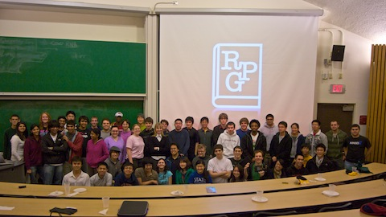

ビジョンが通じたのか、私が学校を去った後、生徒の何人かはそれぞれユニークで素晴らしい授業を作ってくれた。「生徒がつくった、高品質な授業」の比率は年々間違いなく増えている。

言葉で説明するよりも、ビジョンがすぐ分かる製品を作り、みんなをひとつにする。[除菌と美肌効果あるテレビ](http://blog.livedoor.jp/dqnplus/archives/1715232.html)を売るような日本のメーカーも、ぜひSurfaceのように透き通ったビジョンを追求してほしい。

---

### Surfaceのデザインは透き通っていない

しかしSurfaceは手放しに褒められない。世界が誇るアップルファンのJohn Gruber氏は、プレゼンのお粗末さや、マイクロソフトが利益を求めるあまりPCハードウェア企業を突き放したことを[批判](http://daringfireball.net/2012/06/surface_between_rock_and_hardware_place)した。日本が誇るアップルファンの小飼弾氏はそれに加え、画面の向きや機械的なCMを[批判](http://blog.livedoor.jp/dankogai/archives/51805796.html)した。

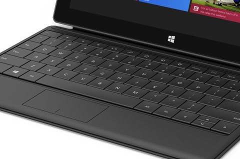

しかしシリコンバレー在住の元デザイナーとして言わせてもらうと、私は「カバー兼キーボードを付属させる」といった選択が一番間違っていると思う。一見便利そうに見えるし、画面にタイピングするよりも早く文字を入力できるだろう(今の若者は逆かもしれないが)。

だがSurfaceはデザインで一番重要な「目的を達成すること」ができていない。それはなぜだか説明しよう。

1. マイクロソフトの目的は透き通ったものを作ること
2. いいとこ取りをすると一番になりにくい
3. 一番になれないと透き通らない

### 1. マイクロソフトの目的は透き通ったものを作ること

これはシリコンバレーの私のアパートから10分、高速101号線沿いにあるiPadの広告である(この記事のためにわざわざ撮影した)。

iPadも白、背景も白、そして空が明るいので、いつも見かけると観光地の広告かな、と思ってしまう。そこにiPadがあることに気づかない。

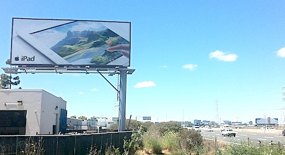

だがそれも狙い通りだ。アップルは製品を人々の生活に溶けこませ、その製品が存在することを「忘れさせる」ためにデザインをしているのだ。デザイン担当上級副社長のIve氏も、「我々の製品はあくまで道具であり、デザインは人の妨げになってはならない」と[語っている](http://www.telegraph.co.uk/technology/apple/9283486/Jonathan-Ive-interview-Apples-design-genius-is-British-to-the-core.html)。

この世界では、誰もが自分の人生の主人公だ。作る側と使う側、どちらも主役になりたいのだ。でも使う側がいなければ、作る側も存在しない。だから我々クリエイターは、死ぬまで脇役に徹するしかないのだ。舞台はつねにユーザーのためにあるべきだ。透き通っていて、背景に溶け込むデザインをすることは、自分のエゴを捨て、相手を尊重することだ。

2005年から2011年までフェイスブックのデザイナーだったSoleio氏も、「フェイスブックは『私を見て!』ではなく『ユーザーを見て!』と言うかのようにデザインされている」と[インタビュー](http://online.wsj.com/article/SB10001424053111904007304576499220914732798.html)で発言していた。平たいUIや16x16ピクセルという小さいアイコンを使うのも、「製品は脇役、ユーザーが主役」を徹底しているからだ。

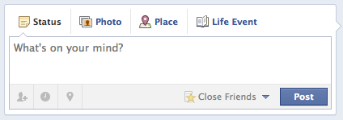

デザインのイノベーションは、イノベーションの未来だと[私はTEDxで話した](/ja/tedxutokyo-speech-draft/)。そしてマイクロソフトも、デザインに会社の将来を賭けている。

PCからタブレットへの流れは「[イノベーションのジレンマ](http://ja.wikipedia.org/wiki/%E3%82%A4%E3%83%8E%E3%83%99%E3%83%BC%E3%82%B7%E3%83%A7%E3%83%B3%E3%81%AE%E3%82%B8%E3%83%AC%E3%83%B3%E3%83%9E)」の次のケーススタディーになるはずだ。少しくらい機能が足りなくとも、使い勝手が優れているタブレットに顧客は飛びつくようになった。

タブレット市場はPC市場と違い、ビジネス向けではなくコンシューマー向けから出発している。B2Bだと「製品を買う人」は「製品を使う人」ではないが、B2Cだと「製品を買う人」が「製品を使う人」になる。だから、B2Cの顧客はB2Bの顧客より使い勝手を気にする。だからタブレット市場ではPC市場よりもデザインが重要になるのだ。

Windows従来のUIも、PCハードウェア企業との提携も、マイクロソフトにとっては「聖域」だった。それを破壊し、Windows 8からUIを大幅に変更したのも(画像:[Wikipedia](http://en.wikipedia.org/wiki/Windows_8#Metro_UI))、Surfaceのハードウェアを自作して垂直統合に踏み切ったのも、マイクロソフトは企業体質をどうしてもデザイン中心にしたいからだ。

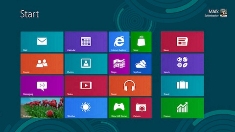

そうしないと、デザインが最重要とされるタブレット市場で、コンシューマー向けのデザインがもともと強いアップル、グーグル、アマゾンの三者相手に戦えないのだ。そしてタブレット市場はいずれPC市場を飲み込む勢いなので、そこで負けたらマイクロソフトは危機に陥ると知っているのだ。

「M$は今まで通りで大丈夫」「M$がデザインを極める意味はない」「PCの既得権益で食ってける」と思っているあなたのように、イノベーションの波に乗れない人たちが、日の丸家電を[手遅れ](http://jp.wsj.com/Japan/Economy/node_468221)にさせたのだ。

だからSurfaceを設計する上でも、「我々はデザインを理解し、最重要視している」と社員に、そして世界に示す必要があった。そしてその手段は先ほど述べたデザインの基本、「透き通ったものを作ること」だ。

それを裏付けるように、デザイナーのPanay氏もイベントで「Surfaceのハードウェアを背景に消すことが重要だった(32:06)」と言い、Ballmer氏はそれによって「ユーザーのパッション、アイデア、想像力、喜びを表(Surface)に出すことができる(11:03)」と言う。

だが、「透き通ったものを作る」という、マイクロソフトの努力は失敗に終わると私は考える。

そしてその理由は、「カバー兼キーボードを付属させる」といった決断にあると思う。なぜだか説明しよう。

### 2. いいとこ取りをすると一番になりにくい

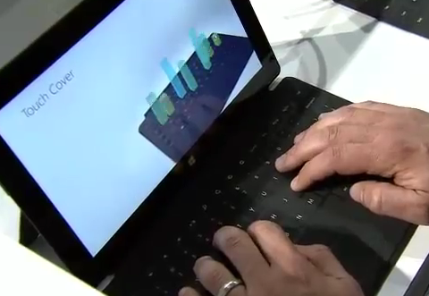

まだ誰もSurfaceのカバー兼キーボードを実際に使ってはいないが、おそらくiPadの画面に出てくるような、いわゆるソフトウェアキーボードよりは打ちやすいが、MacbookやThinkpadなどに備わっているハードウェアキーボードよりは打ちづらい、というのが妥当だと思う。

もし従来のハードウェアキーボードよりも打ちやすいのなら、カバー兼キーボード(二種類あるが、薄いほう)は3ミリで軽量なので、マイクロソフトはそれをキーボード単体で発売し、キーボードラインナップの主力製品にしているはずだ。でもそうはならないだろう。従来のキーボードが、一番打ちやすいのだ。

Huffington PostもSurfaceにあってiPadにないものを7つ[紹介した](http://www.huffingtonpost.com/2012/06/19/surface-ipad-tablet_n_1610331.html)が、カバー兼キーボードを含む半分以上が「タブレットをPCに近づけようとして、つけた」機能である。しかしそれは全ての面でPCに劣っている。

* カバー兼キーボード→先ほど述べたとおり、PC付属のキーボードに劣る
* スタンド→角度を変えられないので、PCのモニターに劣る
* USBポート→他のポートがなく、USBポートですら2つしかないので、PCに劣る
* Office→兼価版ではフルバージョンのOfficeを使えないので、PCに劣る

Ballmer氏は「Surfaceに人材、時間、財源をつぎ込んだ(44:57)」と言うが、その理由は「SurfaceをPCに近づける」ためで、「Surfaceをタブレットとして良くする」ためではない。

だからSurfaceはタブレットとしてはiPadに劣る。タブレットの一番の魅力、エンターテイメントを活かすRetina Displayもない。そして小飼弾氏が[言うように](http://blog.livedoor.jp/dankogai/archives/51776133.html)、Surfaceは縦向きにすると縦長すぎて使いづらい。

つまり私が言いたいのは、SurfaceはPCとタブレットのいいとこ取りをした結果、どちらの種目でも二番になってしまったということだ。これは製品のデザインで、トレードオフに逆らおうとしたときによく起こるミスだ。

自分にもそんな経験がある。

私は前職で、とあるウェブアプリのコメントシステムのデザインを担当していた。一応、リリースしたものは[米国TechCrunchにも載った](http://techcrunch.com/2011/09/26/quora-gets-threaded-comments-comment-voting-editing-and-images/)。

改善するまでは、コメントシステムは次の図のように直線的だった。2ちゃんねるのようなシステムだ。

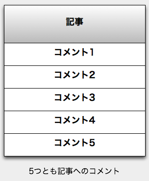

このシステムを、ツリー型にするのがデザインの目標だった。ツリー型にすれば、コメントに対してコメントをつけることができる。

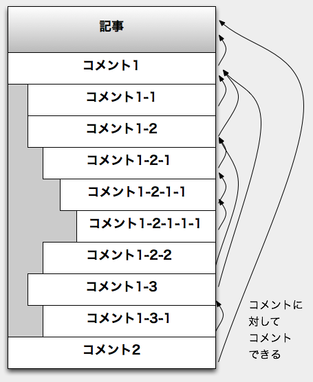

しかし、これには問題があった。階層が深くなると、どのコメントに返信したかが、パッと見分からなくなる。上の図だと、たとえば`1-2-2`は`1-2`に返信したものだが、すぐ真上に`1-2-1-1`があるので、`1-2`に返信したことが分かりづらい。これはツリー型コメントシステムの弱点だ。

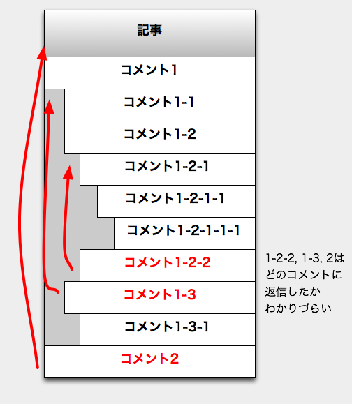

私は直線型とツリー型システムのいいとこ取りができないか考えた結果、次のようなデザインを試みた。`1-2-2`は、`1-2`に返信したが、すぐ真上に`1-2`はない。ならばそうなるように「何度も何度も」`1-2`を配置してしまえばいいのである。そうすればツリー型をキープしつつ、「コメントの上には、必ず返信先のコメントがある」という「直線」を作れる。

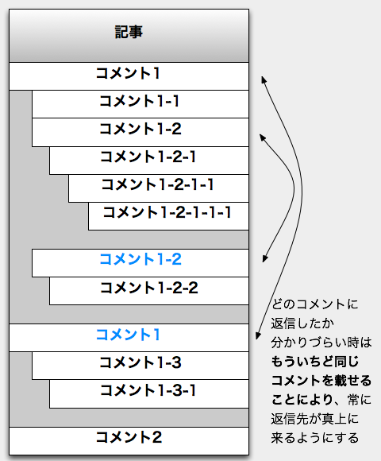

しかし、この「いいとこ取り」デザインは結局ボツにすることになった。

いいとこ取りのデザインは、(1)直線型よりパッと見わかりづらく、(2)ツリー型よりも同じコメントが重複して複雑になってしまうからだ。どうでもいいコメントが何度も何度も配置されてしまうと、ユーザーはたまらないだろう。

長所と短所があるデザインは、嫌われもするが、好かれもする。しかしどっちも中途半端だと、嫌われるしかないのだ。

デザインでは、いいとこ取りをすると一番になりにくいのだ。

### 3. 一番になれないと透き通らない

そして、人は一番を知った上で二番になったり、一番のものを使ったあとで二番のものを使うと、一番にだけに目がいってしまう。でも一番になれば、その先にある何かに集中できる。

二軍の選手の目標は、一軍になることだ。しかし一軍の選手の目標は、いままでにない記録をうちたてることだ。

一番の製品を知った上で、二番の製品を使うと、一番の製品のことに頭がいってしまう。私は海外在住なので、みりんが手に入らなかったときには、砂糖と酒を使って料理している。だがいまひとつだ。「やはり、みりんには敵わない」と考えてしまう。

二番の製品を使うと、二番の製品に足りないものを考えだす。そう意識しだすと、その製品が生活の背景に溶け込みにくくなる。

だが、一番の製品を使っていれば、その製品に足りないものを想像しにくい。そうやって無意識になればなるほど、その製品が生活の背景に溶け込みやすくなる。透き通るようになる。

私のブログを読むような人は、「ウェブを検索する」動作をほぼ反射的に行う。しかしGoogleが覇者でなく、小さな検索エンジンが散らばっていた時代は「どのエンジンで検索すべきか」を「脳を使って」考えなければならず、反射的に検索などできなかった。ダントツで一番の製品があれば、何も考えずそこに向かうことができ、その製品は無意識に使われるようになるのだ。だからコンシューマー向けWebサービスは「一人勝ち」しなければ生き残れない、とよく言われるのだ。

マイクロソフトの努力の結果、Surfaceは「一番のタブレットで、一番のPC」ではなく、「良いタブレットで、良いPC」になった。しかしそれでは、ユーザーの背景に溶けこめないと私は思うのだ。そしてカバー兼キーボードがある限り、リソースをPCサイドに投下する限り、Surfaceがどちらかで一番になるのは厳しいと思う。

私の話は哲学的かもしれないが、私の前職を含め、シリコンバレーのデザイナーはこういう議論を日常的に行う。アップルの中でも、こういった議論が行われていたはずだ。

だからこそ、Cook氏も[AllThingsD](http://allthingsd.com/20120529/cook-tablets-shouldnt-be-burdened-by-pc-legacy/)のインタビューで「タブレットかPCか、どちらか選ばないと、ベストな製品は作れない」と発言したのだ。だからこそ、Jobs氏は[iPad発表イベント](http://www.youtube.com/watch?v=WLBQVKwcIDw)で、「iPadは、MacよりもiPhoneよりも遥かに得意なことがある」と言い、「Webサーフィン、Eメール、写真、ビデオ、音楽、ゲーム、電子書籍がMacよりもiPhoneよりも優れてなければ---iPadの存在意義はない」と言ったのだ。

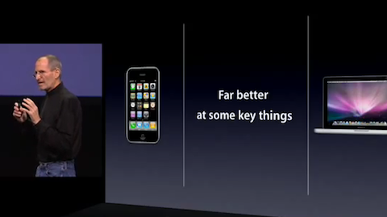

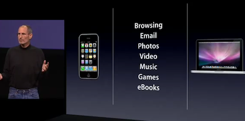

### おわりに

まとめると、マイクロソフトはデザインに会社の運命をまかせ、デザインの基本通り透き通ったものを作ることを目標とした。だが、SurfaceはタブレットとPCのいいとこ取りをしようとして、どちらも中途半端になった。iPadやPCといった、どちらかで一番の製品が存在する今、どちらも二番手なSurfaceを投入しても、それはユーザーの生活の背景に溶けこまない。これが私の考えだ。

もちろん、そもそもM$と林檎は違うとか、現段階でビジネス用にSurfaceは一番向いているとか、タブレットとPCの二台持ちをしなくてすむとか、そういう意見があるのは分かっている。私は元デザイナーとして、マイクロソフトがデザインにとてつもない投資をしていること、そしてそれが上手くいっていないことにコメントしているだけだ。

デザインの良し悪しは、後世に残るかどうかで決まると、こないだ[インタビュー](http://engineer.typemag.jp/worklife/2012/04/-quoranew-order-05.php)されたとき語った。

後世に残ったデザインのひとつで、私が大好きなのは[UNIXオペレーティングシステム](http://ja.wikipedia.org/wiki/UNIX)の設計だ。43年前に作られたUNIXはいまやインターネット上の殆どのサーバー技術を支え、iOSやAndroidといったOSも、UNIX上で動いている。

UNIXの設計には、[次のような哲学](http://ja.wikipedia.org/wiki/UNIX%E5%93%B2%E5%AD%A6)が用いられている。

> 一つのことを行い、またそれをうまくやるプログラムを書け。— M. D. マキルロイ, UNIXの四半世紀

マイクロソフトがUNIXに背いたように、Surfaceは一つのことを上手くやることに背いた。それがどういうことかは、時間が教えてくれると思う。
