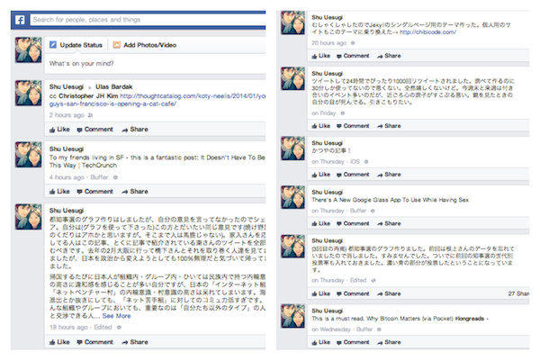
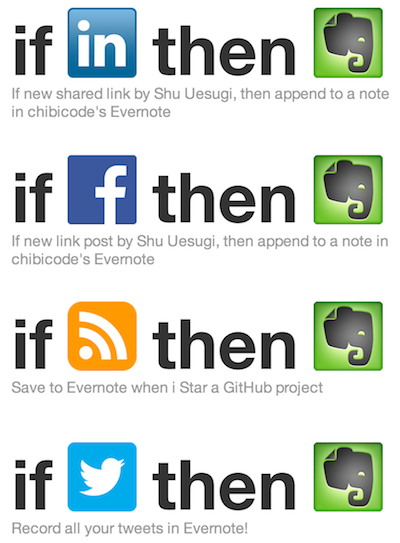

# Waza

こんにちは。シリコンバレーの[EdSurge](https://www.edsurge.com/)社でデザイナーをやっている[@chibicode](http://twitter.com/chibicode)と申します。自己紹介は[こちらです](http://j.chibicode.com)。

ここでは自分の仕事術や情報収集術を掲載しています。

ちなみにこのページはブログ記事ではなく、`waza.chibicode.com`という「ホームページ」です。今や死語ですね。ホームページなので随時更新中ですが、更新をお知らせする予定はありません。いちおう、このページのソースコードと更新履歴はGitHubで[公開しています](https://github.com/chibicode/waza.chibicode.com/commits/gh-pages)。

<a href="https://twitter.com/share" class="twitter-share-button" data-lang="ja" data-size="large" data-dnt="true" data-via="chibicode">ツイート</a> <a href="https://twitter.com/chibicode" class="twitter-follow-button" data-show-screen-name="false" data-show-count="true" data-size="large" data-lang="ja">Follow @chibicode</a>

## なぜ書いたのか

そもそもこのページを設置した理由はふたつあります。

ひとつめは、近ごろ自分の仕事の出来なさぶりに幻滅しており、自分の仕事術や情報収集術を振り返っているうちに、それを文字に落としこんで反省点を探りたいと思ったからです。

もちろん、仕事術の良し悪しがアウトプットに大して影響しない事は承知の上です。どんな仕事術も「目の前の一切に手を抜かない」ことには敵いませんし、それができないことが自分の本質的な問題なのですけどね。

> 目の前にあるバイト一つに全力出せずに夢なんか見つかるんだろうか。目の前にある仕事一つに本気になれずに、目標とか立てられるんだろうか？目の前の事に手を抜いて、自分がやりたいことが見つかるんだろうか？
>
> (出典:[高卒でバカなのに最高に楽しい僕の生き方と守りぬいてきたこと](http://webya.opdsgn.com/thinking/getoutofyourworld/))

ふたつめは、日本の方に「どういうツールを使ってらっしゃるのですか」「どこで情報収集をされているのですか」とよく聞かれるからです。何度も同じ答えを返すのは面倒なので、ここにまとめることにしました。

ちなみに、英語圏ではThe Setupという、著名人の仕事術を無料で掲載しているサイトが[あります](http://j.ktamura.com/archives/2170)。

> <a href="http://www.usesthis.com">The Setup</a>というサイトがある。<a href="http://ideamensch.com/daniel-bogan/">Daniel Bogan</a>さんが、Flickrでエンジニアをする傍ら、いろんな人に、どんなツールを使って仕事をしているかインタビューするというものだ。過去４年間でインタビューの数は２５０を超え、その対象も<a href="http://richard.stallman.usesthis.com/">著名なハッカー</a>、<a href="http://john.gruber.usesthis.com">Appleブロガー</a>、<a href="http://chris.ilias.usesthis.com/">シェフ</a>、<a href="http://james.freeman.usesthis.com/">Blue Bottle Coffeeの創業者</a>と多岐に渡る。(中略)ツールと言っても、職業により包丁からコンピューターまでいろいろで、それぞれの趣向や哲学が反映されていて面白い。
>
> (出典: [とにかく聞いてみる](http://j.ktamura.com/archives/2170))

日本語圏でも似たようなものがあれば良かったのですが、日本では、他人の勉強術や仕事術は本で知るのが当たり前のようです。

私見ですが、勉強術や仕事術というのは「言うは易く行うは難し」です。それゆえ「言う」部分、つまり情報は無料にし、他人が「行う」のを助ける部分でマネタイズするべきです。

とかいいつつも、ここで紹介している本にはアフィリエイトのリンクがついているんですけどね。情報自体は無料にしているので許してください。

それでは本題に入りましょう。

## 目次

注:この文章は書きかけです。実際に業務で心がけていることなど、書きたいことの8割が書けていませんが、現段階でもかろうじて読める出来だと思います。繰り返しますが、このページは随時更新していく予定です。

* **[情報収集はすべてメーリス](#mailinglist)** (2013/1/26追加)
* **[タスク管理はすべてEvernote](#evernote)** (2013/1/26追加)
* **[読んでいる・読んだ本など](#books)** (2013/1/26追加)

---

## 情報収集はすべてメーリス(メーリングリスト)

Googleリーダーがお亡くなりになられる2~3年ほど前から、わたしはRSSやツイッターで情報収集をするのをやめていました。メーリスならキュレーションの恩恵を受けられるうえ、情報収集は週に2~3回、いっぺんにやってしまったほうが時間の無駄が少ないからです。

また、英語圏では[MailChimp](http://mailchimp.com/)というUXの優れたメーリス配信プラットフォームが普及しており、購読や購読解除がしやすく、見た目も綺麗なメーリスが多く存在しています。

現在購読しているメーリスは以下のとおりです。ちなみにすべて無料です。

* **[Hacker Newsletter](http://www.hackernewsletter.com/):** 3年ほど前から毎週欠かさず読んでいます。Hacker Newsに投稿されている記事で人気があったものが送られてきます。半分以上の記事にはどんなに忙しくても目を通すようにしています。
* **[The Changelog](http://thechangelog.com/weekly/):** こちらも大学時代から大好きだったメディアです。オープンソース界で起こった出来事を毎週まとめてくれます。[過去ログはこちらです](http://thechangelog.com/weekly/archive/)。
* **[GitHub Explore](https://github.com/explore/subscribe):** GitHub上で人気があったレポジトリを毎週送ってきてくれます。
* **[Ruby Weekly](http://rubyweekly.com/):** 今週のRubyのニュースをお届け。
* **[JavaScript Weekly](http://javascriptweekly.com/):** 今週のJavaScriptのニュースをお届け。ほかにも[Postgres](http://postgresweekly.com/)、[Dart](http://dartweekly.com/)、[HTML5](http://html5weekly.com/)、[DB](http://dbweekly.com/)、[Node](http://nodeweekly.com/)のメーリスがあります。
* **[Sidebar](http://sidebar.io/):** お好きな頻度でデザインの人気記事を送ってきてくれます。デザイン系のサイトやメーリスは数多くありますが、Sidebarのキュレーションの質は群を抜いています。
* **[Product Hunt](http://www.producthunt.co/):** つい最近登場したサービスで、新しくローンチしたプロダクトについてデザイナーさんたちが語るサービスです。メーリスに登録すると、最近ローンチしたプロダクトをまとめて届けてくれます。デフォルトだと毎日届きますが、毎週届くように変更することもできます。これのおかげでTechCrunchを見ないで済んでいます。
* **[Startup Digest Silicon Valley/SF Bay Area](https://www.startupdigest.com/digests/silicon-valley):** シリコンバレーやサンフランシスコの起業系イベントの開催日を毎週教えてくれます。右上の「Subscribe」から購読できます。
* **[EdSurge](http://www.edsurge.com/):** こちらは自分が働く会社が発行しているメーリスです。教育xITのニュースを毎週お届けします。教育に興味がある方はぜひ。

メーリスが普及している英語圏では、分野内での権威的なメーリスを作ることによって顧客を獲得する戦略が盛んです。ブルーオーシャンな分野はもはや少ない。なので、あなたが興味のある分野の権威的なメーリスは探せば見つかるはずです。たとえば、

* ソーシャルメディアでしたら[Bufferのブログのメーリス](http://blog.bufferapp.com/)がおすすめ。
* ライフハック系でしたら[Zapierのブログのメーリス](https://zapier.com/blog/)がおすすめ。
* 英語の長文を読みたかったら[Longreadsのメーリス](http://longreads.com/)がおすすめ。

メーリス内のリンクはその場で読まず、面白そうと思ったものだけ[Pocket](http://getpocket.com/)に登録して後で読んだりしています。最近はメーリス内のリンクも動画が増えてきたのですが、Pocketは後で観たい動画も登録できるのでおすすめです。

他にもおすすめのメーリスがあれば[Twitter](http://twitter.com/chibicode)で教えてくださいませ。

(追記)[Hacker Newsletter](http://www.hackernewsletter.com/)や[The Changelog](http://thechangelog.com/weekly/)にこのページがトラフィックを相当呼んだようで、中の人に気づかれました。

<blockquote class="twitter-tweet" lang="en">
Big thank you to <a href="https://twitter.com/chibicode">@chibicode</a> for the Hacker Newsletter mention and all the new subscribers from Japan - <a href="http://t.co/Gkqo0ki2kE">http://t.co/Gkqo0ki2kE</a>
&mdash; Kale Davis (@kale) <a href="https://twitter.com/kale/statuses/427656079380455425">January 27, 2014</a></blockquote>

<blockquote class="twitter-tweet" lang="en">
Looks like our new friend <a href="https://twitter.com/chibicode">@chibicode</a> was spreading the love about Weekly! Respect. <a href="http://t.co/nog26ZXkHv">http://t.co/nog26ZXkHv</a> <a href="https://twitter.com/search?q=%23biginjapan&amp;src=hash">#biginjapan</a>
&mdash; The Changelog (@TheChangelog) <a href="https://twitter.com/TheChangelog/statuses/427336666341068800">January 26, 2014</a></blockquote>

### 日本語のメルマガ

日本語では情報収集を殆どやっていません。[Gunosy](http://gunosy.com/)もそれが理由で使っていません。

余談ですが、英語でほとんどの情報収集ができるような職種、たとえばIT系の技術職に就く日本人に限って、「英語を勉強する時間がない」とか嘆いているのは何なんでしょうか。「日本語で情報収集しているのは英語ができないからで、だから英語の勉強が必要なんだ」と言われても、一番効率的な教材は、自分が興味のある分野の英文ですよ。

とは言いつつも、日本語のメルマガは不定期で購読しています。以前は[大前研一さんのメルマガ](http://www.mag2.com/m/0000140789.html)を購読していたのですが、最近は[やまもといちろうさんの「人間迷路」メルマガ(有料)](http://magazine.livedoor.com/magazine/50)一択です。

わたしは中学時代に重度の2ちゃん中毒者だったのですが、その頃からやまもとさんのブログ「[俺様キングダム](http://kirik.tea-nifty.com/)」は追っていまして、日本にはこんなに頭がいい人がいるんだなと感心しておりました。[こちらは彼が27歳のときに書いた記事ですが](http://web.archive.org/web/20041105235530/http://www.din.or.jp/~norihide/doc/kirik/vcc2.html)、26歳の自分としましては、一生かかってもこんなに鋭い文章が書けるとは思っていません。一読を勧めます。

> 日本の産業史をまともに勉強した人なら、現在の商工族や建設族形成のメカニズムなんていうもんも俎上に上がったかと思いますけど、なーんか全く同じ構造ですなあ。高度成長でたくさんビルが建って、そこにはエレベータを数基配置するので板金業も潤い、コンパネを作るタレパン屋(タレット・パンチングマシーンを入れている部品加工業者)がけたたましく儲かり、そいつらが利立てすることに政治家が介在し、またさらに利権化してタレパン屋が儲かるという構造ですけど、今回のＩＴブーム、底辺がタレパン屋がホームページ製作業者になっただけの話で、他は一切変わっていなかったりします。
>
> むろん、産業空洞化とか何とか言われるはるか前から板金業は地盤沈下しているわけですけど、要するに汎用加工品は海外に流れ、粗利の取れる非量産品に全てシフトしたりしてました。
>
> そこには、通産省の産業政策の失敗もあって、例えば中小企業高度化融資なんてのがありますが、要するに大田区の町工場から地方に大きい工場を出すと低利融資が受けられるなんて制度を作って、採算が合わないのに低利もへったくれもないことに気づく業者は少なく、結局おおくの会社が採算割れの状態で苦しんでいたりします。
>
> どんな産業であれ、必ず黎明期があって、混乱期があって、成長期があって、成熟するという観点からすればそれは自然なのでしょうが、産業革命に匹敵すると豪語していた一部論客の煽り方からすれば、なにもＩＴ業界まで利権構造に組み入れられなくてもいいだろうという気もするんですがね。
>
> (出典:[ゼネコン化するＩＴ業界](http://web.archive.org/web/20041105235530/http://www.din.or.jp/~norihide/doc/kirik/vcc2.html))

### ニュースサイト

ニュースサイトは殆ど見ていないのですが、ニュースが読みたいなと思ったら[Quartz](http://qz.com/)を読んでいます。ニュースはこれ一択です。Quartzにはメルマガもあるのですが、更新頻度が毎日なのでヘビー過ぎて購読していません。

### ソーシャルメディア経由の情報収集

SNSを「メインの」情報収集に使っている人は、悪いこと言わないからやめたほうがいいと思います。「メインの」というのがミソです。たまになら良いのですが、質の低い記事しか読まない人ばかりフォローしていると質の低い記事しか入ってこなくなります。そしてそれに気づいていない人が多すぎです。

以下、自分のソーシャルメディアとの付き合い方です。LinkedInやGoogle+は省略しています。

* **Facebook:** 全友達のフィード購読を解除しています。つまりわたしのフィードには自分の投稿しかありません。ページの購読も解除しています。画像にするとこんな感じです。

  

  こうすることで、Facebook上で費やしてしまう時間を強制的に下げています。「誰々が結婚した」「転職した」などの大ニュースには乗り遅れてしまうのが難点ですが、背に腹は代えられません。

* **Twitter:** Twitterでは主にメルマガで読んだ記事を右から左へ流しています。友達との交流はFacebookメッセージを使っています。

### まとめ

情報強者とは、常に最新の情報を知っている人ではなく、質の低い情報を仕入れない人のことを指すのです。ファストフードを避けるのと同じことです。選挙報道など、後々役に立たない情報に触れる必要があるのなら、「週◯時間以下だけ読む」とあらかじめ上限を決めるようにしたいものです。

[↑ 目次に戻る](#index)

---

## タスク管理はすべてEvernote

タスク管理の方法は[GTD](http://ja.wikipedia.org/wiki/Getting_Things_Done)で、ツールは[Evernote](http://evernote.com/intl/jp/)を利用しています。

GTDはシリコンバレーでも有名で、わたしは勉強で忙殺されていたアメリカの大学時代から使っていました。ご存じない方には<a href="http://www.amazon.co.jp/gp/product/4576082116/ref=as_li_ss_tl?ie=UTF8&camp=247&creative=7399&creativeASIN=4576082116&linkCode=as2&tag=chibicode-22">こちらの本</a>がおすすめです。以前は[Things](http://culturedcode.com/things/)でGTDを実践していたのですが、Evernoteにリマインダー機能がついたあたりで乗り換えました。

### Evernoteのノート構成

Evernoteでは次のようなノートブックを作っています。ノートではなく、ノートブックです。

* **Current:** 「いま」取り組んでいるタスクに関するノートをここに入れています。**Current**ノートブックにあるノートは常に一つだけです。

  そして、このノートブックをショートカットの一番上に登録しています。これにより、キーボードで&#8984;+1とすれば「いま」やるべきタスクが何か分かるようになっています。

* **Inbox:** GTDの「収集」ステップで集めたノートはすべて**Inbox**ノートブックに収納されます。収集ステップと、**Inbox**に入ったノートの振り分け方については後ほど詳しく説明します。

* **Next Action:** 取るべき次のアクションに関するノートはこちらに。一つのタスクに対し一つのノートがあります。

  タスクに取り組む時が来たら、ノートを**Current**ノートブックに移動します。

* **P [プロジェクト名]**:「P Waza執筆」という風に、Pから始まる名前をつけます。タスクを終えるのに何度ものステップや資料が必要な場合は、**Next Action**ノートブックにノートを入れるのではなく、それぞれ新しくノートブックを作り、各ステップや資料ごとにノートを作ります。

  こちらも、現在取り組んでいるステップは逐一**Current**ノートブックに移動します。

* **Scheduled:** 連絡を待っているタスクや、とある日時以降でしか終えることができないタスクは、Scheduledノートブックに入れます。そしてタスクを始められるかどうかを見直す日にリマインダーを指定します。タスクを始められるようなら、**Next Action**ノートブックに移動します。

  ちなみにGTDでは「いつかやる」リストがありますが、それに関するノートも**Scheduled**ノートブックに入れてしまいます。しばらくは開始できないようなタスクでも、リマインダーを数カ月や一年後などに指定してしまえば良いのです。

  **Scheduled**ノートブック内では、リマインダーを日付順に並び替えて表示させています。一定期間で繰り返されるタスクを作成できないのがEvernoteの欠点ですが、仕方ないのでカレンダーアプリを使っています。

* **Tagged:** GTDにおける「資料」のノートブックです。Webクリッパーでダウンロードしたサイトがほとんどですが、自分が取ったメモなども全てこちらに入れています。

  また、**Tagged**ノートブックに入っているノートには全てタグがついています。タグの付け方については後ほど。

また、Evernoteには[ノートにチェックリストを作成する機能がある](http://blog.evernote.com/jp/2012/03/22/7041)ので、これも多用しています。シフトキーを押しながら&#8984;+Tで作れます。

### GTDに直接リンクしないノートブック

Evernoteには「スタック」というノートブックをまとめる機能があり、わたしは二つのスタックを作っています。GTDに関連するノートブック用にひとつと、それ以外のノートブック用にひとつです。

GTDのプロセスから外れたノートブックは以下の通りです。

* 終了したプロジェクトのノートブックはすべて保存しています。一文字目の「P」を「PA」という名前に変えています。Aはアーカイブという意味です。
* [Penultimate](http://evernote.com/intl/jp/penultimate/)・[Skitch](http://evernote.com/intl/jp/skitch/)・[IFTTT](http://ifttt.com/)など、Evernoteと連携するアプリひとつにそれぞれノートブックを作っています。

IFTTTでは自分のツイート、FacebookやLinkedInへの投稿、GitHubでスターしたものを自動でEvernoteに保存するレシピを走らせています。わたしはライフログ(笑)厨ではありませんが、TwitterやFacebook上では過去の投稿を検索しにくいため、Evernoteに自動で保存して全文検索をかけられるようにしています。

### Dashboardノート

また、ノートブックではありませんが、**Dashboard**というノートを一つ作成しています。ノートブックではなく、ノートです。

**Dashboard**ノートには今日一日の予定を毎朝書き込んでいます。カレンダーも使ってるのですが、カレンダーの内容を書き写すこと、そして空いてる時間にどのタスクをやるかを「あらかじめ」書き込んでおくことは意外にも役に立っています。

他にも、**Dashboard**ノートには次のようなことを書いています。

* 現在進行中のプロジェクトと、それぞれに一週間でどれくらい時間を割くべきか
* 現在読み進めている本のリスト
* 息抜きにやることのリスト

**Dashboard**ノートもショートカットの二番目に登録しているので、キーボードの&#8984;+2でアクセスできます。

### 収集の方法

GTDの「収集」ステップは、以下のように行っています。

* Inboxに入るノートの半分近くは、[FastEverアプリ](https://itunes.apple.com/jp/app/fastever-su-zaoku-jian-dannievernotenimemo/id364580273?mt=8)で作成したものです。

  FastEverは素早くメモを作成するアプリで、自分がiPhoneで一番多用しているアプリです。とにかく「これは忘れたくない」と思ったらFastEverをすぐさま開くようにしています。

* Inboxに入るノートの残りの半分近くは、[自分のEvernote用メルアドにメールを転送する](https://blog.evernote.com/jp/2010/08/31/1010)ことで作成しています。

  仕事をしているとEメールの受信箱がTODOリストになりやすいのですが、それは避けるようにしています。TODOリストは一箇所が原則。「このメールは今すぐ返事できないな」と思ったらすぐさまEvernoteに転送し、一つのタスクとみなしています。昔は使っていたGメールのスター機能も使いません。この「Eメールから直接TODOを作成できる機能」がThingsから乗り換える決め手となりました。

  また、iPhoneから面白いサイトを見ていて、Evernoteに資料として保存したいなと思ったときも、Eメール経由でサイトのURLを保存するようにしています。モバイル用のWebクリッパーが今のところないので。

* たまに直接Inboxにノートを作ったり、iPhoneで撮った写真をInboxに入れますが、FastEverかEメール経由で収集することがほとんどです。

### タグの付け方

自分は[Webクリッパー](http://evernote.com/intl/jp/webclipper/)を多用していまして、ブックマーク代わりに使っています。はてブなどのブックマークサービスは一切利用していません。Webクリッパーからは、先ほど触れた**Tagged**ノートブックに直接保存しています。

さて、**Tagged**ノートブックに入るノートのタグ付け方ですが、[大まかなカテゴリー名]-[細かいカテゴリー名]-[とても細かいカテゴリー名]、というふうにタグを付けています。細かいカテゴリー名と、とても細かいカテゴリー名は省略可能です。こんな感じです。

* `personalfinance`
* `design-fonts`
* `coding-js-angular`

一つのノートには一つしかタグを付けていません。`coding-js-angular`を`coding`、`js`、`angular`といった3つのタグに分けないのは、`angular`のような細かいカテゴリー名は一目見たときに何か分からないからです。また、大まかなカテゴリー名をひと通り覚えておけば、Evernoteのタグ付けUIが残りを予測変換してくれます。

自分は「あとで読む」サービスとして[Pocket](http://getpocket.com/)を使っていて、Pocketから直接**Tagged**ノートブックに放り込むときもあります。タグの自動補完がされないので、とりあえず`pocket`というタグをつけておき、一定期間で見なおしてタグを付けるという作業を行っています。

### まとめ

わたしはEvernoteのステマ師ではありませんが、Evernote最高です。[プレミアム会員](http://evernote.com/intl/jp/premium/)にもなっています。もう紙を殆ど使わなくなりました。

[↑ 目次に戻る](#index)

---

## 読んでいる・読んだ本など

日本語・英語問わず、自分は小さいころから漫画以外の活字を読まずに育ちました。はじめて本屋で専門書以外の本を買ったのは二十歳を過ぎてからかもしれないです。

シリコンバレーに住んでいると、日米問わず優秀な人とお付き合いさせてもらうことが多いのですが、やはりみなさん多読家で、自分はよく劣等感の殻に閉じこもってしまいます。活字のシャワーを浴びなかったことをとても後悔しています。

いまでも、小説は年に一冊読むか読まないかだし、ノンフィクションも難しい本は読めていません。いつも何かを学ぶために本を読んでいて、純粋に読書を楽しむ時間も持てていません。プログラミングに関する本は、自分のキャリアがかかっているので月1冊のペースで読んでいるのですが、それ以外の分野ではさっぱりです。

恥ずかしい限りです。

### オーディオブック

ノンフィクションは[Audible](http://www.audible.com/)が作成しているオーディオブックで読むことが多いです。ダウンロードして車で聴いています。通勤に片道30分かかるので、長めの本でも3週間もあれば読了することできます。もちろん全部英語です。

このページの初回公開時に聴いているオーディオブックはかの有名な<a href="http://www.amazon.co.jp/gp/product/B00DNMG8Q2/ref=as_li_ss_tl?ie=UTF8&camp=247&creative=7399&creativeASIN=B00DNMG8Q2&linkCode=as2&tag=chibicode-22">銃・病原菌・鉄</a>です。

オーディオブックがない本はKindle本を買ってiPad Miniで読んでいます。日本の本もKindleで買ってKindle Fireで読んでいます。

### 2013年に読んだ本

2013年に読んだ本を書き出しましたが、そんなに難しい本は読んでいませんので期待しないで下さい。もっと知的好奇心を得たいという方は代わりに[こちらのリスト](http://j.ktamura.com/archives/22777)を眺めてみてください。

日本語訳が出ているものも全て英語で読んだのですが、こちらでは日本語訳のタイトルとリンクを貼っています。

* **<a href="http://www.amazon.co.jp/gp/product/B004WL4BW6/ref=as_li_ss_tl?ie=UTF8&camp=247&creative=7399&creativeASIN=B004WL4BW6&linkCode=as2&tag=chibicode-22">I Will Teach You To Be Rich</a>:** アメリカの一般市民向けのお金の本です。著者は元シリコンバレーの起業家。[彼のYouTubeチャンネル](http://www.youtube.com/user/ramitsethi)は、[ホリエモンのYouTubeチャンネル](http://www.youtube.com/user/takaponjp)と内容がそっくり。ちなみにこの本はオーディオブックで読みました。
* **<a href="http://www.amazon.co.jp/gp/product/4822242633/ref=as_li_ss_tl?ie=UTF8&camp=247&creative=7399&creativeASIN=4822242633&linkCode=as2&tag=chibicode-22">ビジョナリー・カンパニー 2 - 飛躍の法則</a>:** 言わずと知れた名著です。「厳しい現実を直視する(第三章)」のが苦手な人とは一緒にいたくありません。オーディオブックで読みました。
* **<a href="http://www.amazon.co.jp/gp/product/B00CDSTBG6/ref=as_li_ss_tl?ie=UTF8&camp=247&creative=7399&creativeASIN=B00CDSTBG6&linkCode=as2&tag=chibicode-22">Finnish Lessons: What Can the World Learn from Educational Change in Finland?</a>:** フィンランドの教育についての本です。情報量が凄かったのですが、あまり覚えていません。オーディオブックで読みました。
* **<a href="http://www.amazon.co.jp/gp/product/B005P0YXKI/ref=as_li_ss_tl?ie=UTF8&camp=247&creative=7399&creativeASIN=B005P0YXKI&linkCode=as2&tag=chibicode-22">The Death and Life of the Great American School System</a>:** なぜアメリカの教育改革は成功していないのかが書かれている本です。アメリカの教育制度について勉強したい方はこれ一冊読めばOKです。オーディオブックで読みました。
* **<a href="http://www.amazon.co.jp/gp/product/B00CPW2Z9U/ref=as_li_ss_tl?ie=UTF8&camp=247&creative=7399&creativeASIN=B00CPW2Z9U&linkCode=as2&tag=chibicode-22">マネー・ボール</a>:** 映画は観てませんが、傑作です。マイケル・ルイスのファンになりました。オーディオブックで読みました。
* **<a href="http://www.amazon.co.jp/gp/product/4167651866/ref=as_li_ss_tl?ie=UTF8&camp=247&creative=7399&creativeASIN=4167651866&linkCode=as2&tag=chibicode-22">世紀の空売り 世界経済の破綻に賭けた男たち</a>:** こちらもマイケル・ルイス作。2013年に読んだ本で一番面白かったです。サブプライムローン問題をやっとこさ理解できました。オーディオブックで読みました。
* **<a href="http://www.amazon.co.jp/gp/product/4062184451/ref=as_li_ss_tl?ie=UTF8&camp=247&creative=7399&creativeASIN=4062184451&linkCode=as2&tag=chibicode-22">習慣の力 The Power of Habit</a>:** 最初の半分しか読んでませんが、それでも元が取れたと思える本です。自分の悪習慣を変えたいと思ってる人はぜひ。オーディオブックで読みました。
* **<a href="http://www.amazon.co.jp/gp/product/4152094338/ref=as_li_ss_tl?ie=UTF8&camp=247&creative=7399&creativeASIN=4152094338&linkCode=as2&tag=chibicode-22">強いチームはオフィスを捨てる: 37シグナルズが考える「働き方革命」</a>:** 「<a href="http://www.amazon.co.jp/gp/product/415209267X/ref=as_li_ss_tl?ie=UTF8&camp=247&creative=7399&creativeASIN=415209267X&linkCode=as2&tag=chibicode-22">小さなチーム、大きな仕事</a>」を書いた37シグナルズの最新作です。自分はリモートワーク推進派です。オーディオブックで読みました。
* **<a href="http://www.amazon.co.jp/gp/product/4873116619/ref=as_li_ss_tl?ie=UTF8&camp=247&creative=7399&creativeASIN=4873116619&linkCode=as2&tag=chibicode-22">Lean UX―リーン思考によるユーザエクスペリエンス・デザイン</a>:** うちの会社のバイブルとなっています。UXの本ではなく、プロジェクト管理の本です。
* **<a href="http://www.amazon.co.jp/gp/product/4873115914/ref=as_li_ss_tl?ie=UTF8&camp=247&creative=7399&creativeASIN=4873115914&linkCode=as2&tag=chibicode-22">Running Lean―実践リーンスタートアップ</a>:** 実用書では2013年の個人的ベスト本でした。スタートアップ経営者にとっては必読だと思います。
* **<a href="http://www.amazon.co.jp/gp/product/4873115574/ref=as_li_ss_tl?ie=UTF8&camp=247&creative=7399&creativeASIN=4873115574&linkCode=as2&tag=chibicode-22">インタフェースデザインの心理学 ―ウェブやアプリに新たな視点をもたらす100の指針</a>:** ほとんど内容を覚えていません。デザインは本から学ぶものではないということを痛感させられました。
* **<a href="http://www.amazon.co.jp/gp/product/B00CL6MVA8/ref=as_li_ss_tl?ie=UTF8&camp=247&creative=7399&creativeASIN=B00CL6MVA8&linkCode=as2&tag=chibicode-22">何者</a>:** 自分は小説をほとんど読まないのですが面白かった。日本の文系大学生で、就活のチキンレースにうんざりしている人はぜひ読んでみてください。
* **<a href="http://www.amazon.co.jp/gp/product/B00DAULKW4/ref=as_li_ss_tl?ie=UTF8&camp=247&creative=7399&creativeASIN=B00DAULKW4&linkCode=as2&tag=chibicode-22">「空気」の構造</a>:** 日本人論の決定版。2013年に日本語で読んだ本のなかでは一番おもしろかったです。こちらも日本の学生さんにぜひ読んでもらいたいです。ちなみに、先日この本で紹介されている「<a href="http://www.amazon.co.jp/gp/product/B00BN16XX8/ref=as_li_ss_tl?ie=UTF8&camp=247&creative=7399&creativeASIN=B00BN16XX8&linkCode=as2&tag=chibicode-22">失敗の本質</a>」も読んだのですが、こちらもおすすめです。
* **<a href="http://www.amazon.co.jp/gp/product/B00ARCOVV0/ref=as_li_ss_tl?ie=UTF8&camp=247&creative=7399&creativeASIN=B00ARCOVV0&linkCode=as2&tag=chibicode-22">本音の沖縄問題</a>:** 昨年出会った沖縄出身の素敵な女性に影響されて読んだ本です。沖縄と本土の歴史がこんなに醜いものだとは知りませんでした。
* **<a href="http://www.amazon.co.jp/gp/product/B00ASUY0U8/ref=as_li_ss_tl?ie=UTF8&camp=247&creative=7399&creativeASIN=B00ASUY0U8&linkCode=as2&tag=chibicode-22">日本カジノ戦略</a>:** 最近は日本でもカジノ構想が盛り上がっていますが、この本はラスベガスの大手カジノで長年働いた日本人の方が書いたものです。「カジノは日本の国民性に合わない気がする」と思う方は読んでみてください。
* **<a href="http://www.amazon.co.jp/gp/product/B00E7OQ0TA/ref=as_li_ss_tl?ie=UTF8&camp=247&creative=7399&creativeASIN=B00E7OQ0TA&linkCode=as2&tag=chibicode-22">不格好経営</a>:** DeNAの創業記ですが、自分はそこまで面白いとは思えませんでした。会社の社会的意義を気にしすぎてしまう自分が子供なのでしょうか。
* **<a href="http://www.amazon.co.jp/gp/product/B00GU4R8VE/ref=as_li_ss_tl?ie=UTF8&camp=247&creative=7399&creativeASIN=B00GU4R8VE&linkCode=as2&tag=chibicode-22">リーダーシップの旅～見えないものを見る～</a>:** リーダーシップの本です。「こんな自分でもリーダーになれるかも」と思い込ませてくれる本です。
* **<a href="http://www.amazon.co.jp/gp/product/4061385151/ref=as_li_ss_tl?ie=UTF8&camp=247&creative=7399&creativeASIN=4061385151&linkCode=as2&tag=chibicode-22">武器としての交渉思考</a>:** 交渉については素人なので参考になりました。主に学生向けです。
* **<a href="http://www.amazon.co.jp/gp/product/4413090101/ref=as_li_ss_tl?ie=UTF8&camp=247&creative=7399&creativeASIN=4413090101&linkCode=as2&tag=chibicode-22">自分の中に毒を持て―あなたは“常識人間”を捨てられるか</a>:** いままで日本語で読んだ自己啓発書のなかで一番自己啓発されました。「やりたいことがない」と言う若い人に読んでもらいたいです。
* **<a href="http://www.amazon.co.jp/gp/product/B009CU73KO/ref=as_li_ss_tl?ie=UTF8&camp=247&creative=7399&creativeASIN=B009CU73KO&linkCode=as2&tag=chibicode-22">職業としてのAV女優</a>:** 題材はAV女優ですが、本質的には貧困ビジネスの本です。ものすごい良著です。
* **<a href="http://www.amazon.co.jp/gp/product/4822248712/ref=as_li_ss_tl?ie=UTF8&camp=247&creative=7399&creativeASIN=4822248712&linkCode=as2&tag=chibicode-22">もし小泉進次郎がフリードマンの資本主義と自由を読んだら</a>:** 近未来政治マンガで、アベノミクスが失敗した日本を描いています。少し現実味に欠けていましたが面白かったです。「資本主義と自由」の思想は教育分野では上手くいっていないようですが。
* **<a href="http://www.amazon.co.jp/gp/product/4883351793/ref=as_li_ss_tl?ie=UTF8&camp=247&creative=7399&creativeASIN=4883351793&linkCode=as2&tag=chibicode-22">広告コピーってこう書くんだ!読本</a>:** UIデザインで一番大切なのは言葉なので([参考記事](http://ellekasai.com/posts/this-is-a-web-page/))、コピーライティングの本はたまに手にとっています。この本は短くて分かりやすい。
* **<a href="http://www.amazon.co.jp/gp/product/4904209192/ref=as_li_ss_tl?ie=UTF8&camp=247&creative=7399&creativeASIN=4904209192&linkCode=as2&tag=chibicode-22">電通 洗脳広告代理店</a>:** 内容は低俗でしたが、テレビを見るのをやめさせたい友達がいるのならこの本を勧めるのもありかもです。自分が日本に持っている懸念の1/3近くは電通の存在です。
* **<a href="http://www.amazon.co.jp/gp/product/B009GPMB7U/ref=as_li_ss_tl?ie=UTF8&camp=247&creative=7399&creativeASIN=B009GPMB7U&linkCode=as2&tag=chibicode-22">大学破綻―合併、身売り、倒産の内幕</a>:** アメリカで大学経営をしたことがある著者が日本の大学経営について語った本です。「日本の学生は勉強しない」という紋切り型の台詞が好きな人に読んでもらいたいです。
* **<a href="http://www.amazon.co.jp/gp/product/4004312256/ref=as_li_ss_tl?ie=UTF8&camp=247&creative=7399&creativeASIN=4004312256&linkCode=as2&tag=chibicode-22">ルポ 貧困大国アメリカ II</a>:** <a href="http://www.amazon.co.jp/gp/product/4004311128/ref=as_li_ss_tl?ie=UTF8&camp=247&creative=7399&creativeASIN=4004311128&linkCode=as2&tag=chibicode-22">シリーズ一冊目</a>はかなり前に読んだのですが、シリーズ二冊目のこちらは今年になって読みました。シリコンバレーを訪れる学生にいつもおすすめしているシリーズです。<a href="http://www.amazon.co.jp/gp/product/4004314305/ref=as_li_ss_tl?ie=UTF8&camp=247&creative=7399&creativeASIN=4004314305&linkCode=as2&tag=chibicode-22">シリーズ三冊目</a>も出たようですが、Kindle版が無いのでまだ読めていません。

これ以外にもプログラミングの本を数冊、橋下市長についての本を数冊、池上さんの本を数冊、岩波新書の教育の本を数冊、グラフィックデザイン集を数冊、読んだこと自体を忘れた本を数冊、そして漫画をけっこう読んだのですが、それぞれ紹介しているとキリがないので、今回は省きます。

### まとめ

2014年はもう少し難しい本を読めたらと思っています。

[↑ 目次に戻る](#index)

---

## ありがとうございました

読んで下さってありがとうございました。「お前が仕事ができない理由は、こういうページを作っているからだ」という突っ込みは無しの方向でお願いします。またぼちぼちこのページを更新していく予定です。

<a href="https://twitter.com/share" class="twitter-share-button" data-lang="ja" data-size="large" data-dnt="true" data-via="chibicode">ツイート</a> <a href="https://twitter.com/chibicode" class="twitter-follow-button" data-show-screen-name="false" data-show-count="true" data-size="large" data-lang="ja">Follow @chibicode</a>

### 奥付

このページは[Solo](https://github.com/chibicode/solo)という[Jekyll](http://jekyllrb.com/)のテーマで作成され、[GitHub](https://github.com/chibicode/waza.chibicode.com)でホスティングされています。

[Google+](https://plus.google.com/110325199858284431541?rel=author)
