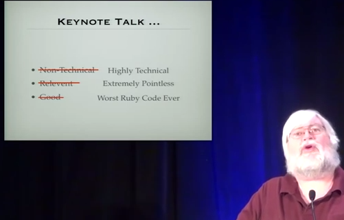
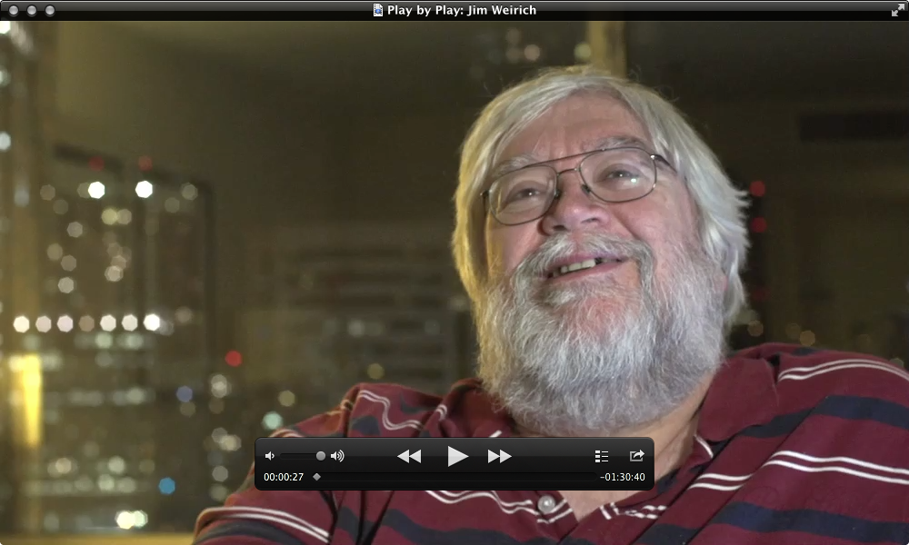

[rakeの作者 Jim Weirich氏、死去](http://tech.a-listers.jp/2014/02/20/creator-of-rake-has-left/)

コロラド州で行われたRubyConf 2012に参加したとき、彼のYコンビネータ―についての基調講演を観させてもらいました。起業家支援プログラムでない方のYコンビネータ―です。

<iframe width="853" height="480" src="//www.youtube.com/embed/FITJMJjASUs?rel=0" frameborder="0" allowfullscreen></iframe> 

プレゼンのはじめに、彼がこう言って参加者を笑わせたのを覚えています。

> 多くの基調講演は技術的ではありません。人々にインスピレーションを与えるべきですからね。しかし、わたしの話は非常に技術的です。
>
> そして、非常に技術的な基調講演では、少なくとも実務に役に立つコードが紹介されるものですが、今回紹介するコードは実務では全く役に立たないでしょう。
>
> また、たとえ実務で使えないコードでも良いコードはたくさんありますが、今回紹介するコードは、あなたが今まで見た中で最悪のコードになるでしょう。(一部略)

この「◯についてのプレゼンあるある」を先に話し、自分はその逆を行きますよ、といってプレゼンを始めるテクニックを、わたしは彼から学びました。[7ヶ月に大阪で講演した際](http://naze.chibicode.com/moocs/)、スライド3から11で、彼のテクニックをぞんぶんに使わせてもらいました。

最後に、彼の[Peepcodeのビデオ](https://peepcode.com/products/play-by-play-jimweirich-ruby)から[抜粋](https://peepcode.com/system/uploads/2012/peepcode-jimweirich-preview.mov):

> 彼は、(日本で生まれた)Ruby言語を英語圏に持ち込んだプログラマーのうちのひとりでした。彼が書いたRakeは、ほぼ全てのRubyプロジェクトに使われています。

ご冥福をお祈りします。
