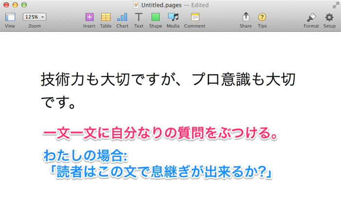
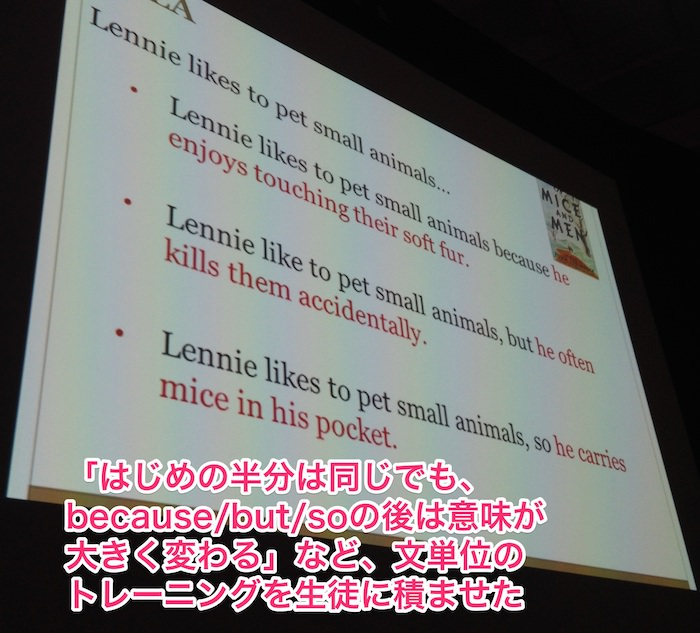

以前書いた「[ネットで文章を書くときに一番気を遣っていること](/tips)」という記事で、わたしはいつも次のパターンにそって主張を書くようにしていると書きました。

[同記事から引用](/tips):

> 自分の経験上、「X = Y」だと思う人が多ければ多いほど、そして「X = Z」だと思う人が少なければ少ないほど、たくさんの方に記事を読んでもらえる気がします。
>
> ブログ初心者の方は、ぜひこのパターンを記事の主張部分に使ってみてください。

その後「他にも気をつけていることはありますか」と何人かに尋ねられたので、文章を書くときに「二番目に」気を遣っていることについて書きました。

### 文章を書くときに二番目に気を遣っていること

わたしは下書き中、空のファイルを使って一文ずつ推敲することを心がけています。

どういうことか、[先月書いた記事](/40-emails)の一段落を使って説明しましょう。

たとえば、次のような文章を下書き段階で書いていたとします。ここではAppleのPagesを使っていますが、多くの人はWordで書かれることでしょう。

まず、最初の文を空のファイルにコピーします。

つぎに、コピーした文に対して自分なりの質問を投げかけます。

わたしの場合、その質問を「読者はこの文で息継ぎが出来るか?」に設定しています。

「こいつの文章のせいで息切れがする」と読者に思われることを、普段からわたしは目標としています。よって、「息継ぎが出来るか?」という質問を一文一文にぶつけることにより、その目標に近づいているか遠ざかっているかを測ろうとしているのです。

もちろん、聞くべき質問は人それぞれですし、一文ごとに質問を変えても構いません。大切なのは、

* あらかじめ自分なりの質問を用意しておき、
* 例外なく、全ての文に真剣に質問をして、
* 例外なく、全ての質問に真剣に答える。

ことです。

さきほどの文の場合、「読者は息継ぎが出来るか?」に対してわたしは「Yes」と答えました。もちろん、独断です。平坦すぎる文や、エッジが効いてない文には、わたしは「これでは読者に息継ぎをさせてしまう。悪文だ」と判断するようにしています。

というわけで、できるだけ読者に息継ぎをさせないよう、文を改善してみました。

ほかの文も空のファイルにコピーし、同じ質問を投げかけて改善していきます。

改善後:

そして最後の文。改善前:

改善後:

これで完了です。もう一度、全体の改善前を見てみましょう。

そして全体の改善後がこちらです。

読んでて息が詰まる感が倍くらいになったのではないでしょうか。もしそうなら、わたしは目標を達成できたわけです。

### なぜわたしは読者の息を詰まらせたいのか

わたしはリアルでは穏やかな人間ので、その正反対なトーンの文章を書くことにより、ギャップ萌えを狙っているからです。モテない男は何事も創意工夫しないといけません。

・・・すみません、冗談です。

本当の理由は、質の低い文章がネットに溢れるのをわたしは許せないからです。理性は許せても美意識が許せません。いまの日本のブログ界は読者にとって壮大な時間の無駄だと思っていて、それに対する憤りをわたしは表現したいのかもしれません。

小学六年生までしか日本語の国語教育を受けなかったわたしが言うのも、偉そうな話なんですけどね。

### なぜ空のファイルを使うのか

文章の基本は「悪文退治」です。悪文の「文」とは「一文」のことであり、一文また一文と、「お前は悪文か?」と問わなければいけません。わたしたちのような文章初心者は、加点主義ではなく減点主義を用いるべきです。

悪文を退治するには、それぞれの文を視覚的に隔離するのが効きます。段落の中にある文は視覚的に集中しにくいのです。

ぎゃくに新しいファイルにぽつん、と同じ文を入れると、その文ひとつに集中しやすくなります。メモするスペースもあるので、複数のバリエーションを書いて比べるということもできます。

「こんな面倒なこと、全ての文でいちいち出来るわけがない」と言わないでください。時間さえかければ出来ないわけはありません。一つ残らずやるのです。

また、上達するにつれあなたの処理速度は向上します。わたしが先日書いたメルマガは8500文字程度でしたが、すべての文に質問を投げかけるのに約3時間しか費やしませんでした。一年前はその10倍ほどかかっていたのですが、やりこみは裏切らないものですね。

### 文章の基本は「文」

一年半前に[エンジニアTypeに寄稿した記事](http://engineer.typemag.jp/article/uesugi-shusaku-24-2)で、アメリカの新しい教育基準「コモン・コア」を設計したデビット・コールマン氏の話と、ニューヨークのとある高校の話を引用したことがありました。

> 彼の名前はデビット・コールマン。エール大、オックスフォード大、ケンブリッジ大を卒業し、マッキンゼーで5年働いたのち、教育会社を創業。それが買収されると、今度はNPOを立ち上げ、Common Core State Standards（以下、コモン・コア）という基準の設計者となった。
>
> (中略) 先月、ニューヨークのNew Dorp高校が、The Atlantic誌で話題になった。なんと2009年まで、多くの高校生が「にもかかわらず(Although)」という言葉を理解できなかったという。これでは実用文など書けやしない。「New Dorp高校の学生が抱える問題は、この国の多くの生徒にも当てはまる」と同誌は指摘する。

きのう、[SXSWEdu](http://sxswedu.com/)という全米最大級の教育カンファレンスに参加してきたのですが、なんとコールマン氏とNew Dorp高校の先生方、そしてThe Atlanticの[記事](http://www.theatlantic.com/magazine/archive/2012/10/the-writing-revolution/309090/?single_page=true)を書いたジャーナリストの方によるパネルディスカッションが行われたのです。すごい偶然でした。

New Dorp高校は文章教育に力を入れた結果、貧困層の生徒の文章力が格段に上がったようなのですが、その経緯がパネルディスカッションで説明されていました。それによると、どうやら彼女らの"Sentence Strategies"、すなわち一文単位で生徒にトレーニングを積ませたのが功を奏したようです。

下の文章は高校生にしては稚拙かもしれませんが、先生方は「センテンスを完璧にしなければ、良いパラグラフなど書けっこない」という考えで、初歩の初歩からのセンテンス教育を充実させたそうです。

それが効果をあらわし、生徒の文章力は格段に上達したとのこと。

世界のどこに行っても、文章の基本は「文」なのですね。文章力の差は、ピリオドとピリオドの間、句点と句点の間に生まれるのです。

そのためには、すべての文に「空のファイル」というVIP並の待遇を与えること。ぜひ試してみてください。

### 悪文退治のお供にしたいリンク

一文を良くするトレーニングには、野内良三さんの<a href="http://www.amazon.co.jp/gp/product/4121020561/ref=as_li_ss_tl?ie=UTF8&camp=247&creative=7399&creativeASIN=4121020561&linkCode=as2&tag=chibicode-22">日本語作文術</a>という本がうってつけです。最初の半分を読むだけでお釣りがくるほどの良著です。

また、[考えることについて書くときに僕の書くN個のこと](http://j.ktamura.com/archives/21667)という記事もおすすめです。以下、わたしが大切だと思っている箇所を抜粋しました。

> * 言葉の定義と同じくらい、言葉の配置も厳密に考える。たとえば、「厳密に考えられた言葉の配置」だと、厳密に考えられているのが「言葉」なのか「配置」なのかわからない。
>
> * 句読点も大事。「この文、このままだと長いから読点を打とうかな」と思う時は、必ず「ここで一度句点を入れる」というオプションを常に検討する。でも最終的には、句読点のルール云々よりも、読みやすさを最重視する。
>
> * 読点を打つとちょっとブツ切り感が強すぎる場合、平仮名・カタカナ・漢字が持つ「お互いルックスが違いすぎて、視覚的に境界で切れる」感を利用する。例えば前文だと、「ちょっとぶつ切り」より「ちょっとブツ切り」の方が読みやすい。
>
> * カタカナは文章構成のからくりとして、非常に万能である。普段は平仮名あるいは漢字で書く言葉も、カタカナにすると、急にポップになったり（例：キモチ）、高尚すぎて理解が及ばない感が出たり（例：キカイガクシュウ）する。逆に平仮名にすると、急に親近感が増す
>
> * 「動詞＋副詞」という構成をみたら、それを「動詞」だけで置き換えられないか考える。例えば、「けっこう話が飛ぶ」の代わりに「話が飛躍する」とか。そうすることで、無駄な形容詞や副詞がなくなる。
>
> * 文章をシンプルに保つのは大事だが、かといって短い文章を羅列すると、小学一年生の夏休みの日記になってしまうので、文の長さにバリエーションを持たせる。するとビックリするくらい可読性があがる。特にだーっと長い（けど読みやすい）文を書いた後に、段落を変えて短い一文を書くと、それだけで短い２番目の文は強い印象を与える。
>
> * 読者は、その人特有の視点で読む。別の言い方をすれば、たとえ文章すべてに共感できなくても、その文章の中で読者の視点と強く共鳴するものがあれば、残りの部分は目をつむってくれる。なので、ひとつのことを多角的な視点で書く方が、単一の視点で複数のことについて書くよりも、多数の人間の共感を得やすい。言わずもがなだが、多角的な視点で複数のことについて書いたら収拾がつかなくなる。
>
> * 顔文字は極力使わない（^_^;）

### ありがとうございました

これからはブログよりメルマガに長文を書くつもりですので、よければ[こちらのリンクから](http://bit.ly/chibimail)購読してくれると嬉しいです。
