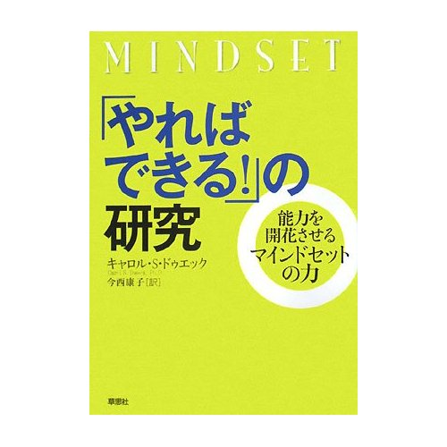

スタンフォード大のキャロル S.ドゥエック教授の名著・「[『やればできる!』の研究](http://www.amazon.co.jp/gp/product/4794216807?tag=chibicode-22)」についてのレビューをまとめました。現在わたしが勤めているシリコンバレーの教育ベンチャー・[EdSurge](http://edsurge.com/)社内でも、彼女の研究はよく話題になっています。

## 「[おでこのめがねで読書レビュー](http://lhflux.seesaa.net/article/169800106.html)」より

> こちこちマインドとは、自分の能力は石版に刻みこまれたように固定的で変わらないと信じている人(p.16)のことを指す。頭がよかったり、スポーツが得意なのはすべて生まれ持った才能のなせる業で、遺伝による支配も大きいと信じる人達である。個人の知的能力、運動能力、芸術センスは一定であって、あるレベルにまでは到達できたとしても、それ以上向上させることは不可能だと主張する。こういったものは、頭蓋骨や脳の大きさ、筋肉の質によって産まれた時点ですでに決まっていると考える。例えば、アジア系の人種はアフリカ系の人種と比べて筋肉の質で劣るから、運動では絶対に勝つことができない、と主張する。脳の仕組みからいって、女性は数学ができないもんだ、という。ハリーポッターの寮でいえば、スリザリンに相当する。

> そして、こちこちマインドを持った人は、人よりも優れていることを示すことで安心する。しくじらずにうまくできるか、人から賢そうに見えるかをいつも気にかける。 成功を決するのは才能、失敗は能力が劣る証拠、努力は才能なき者の悪あがき (p.70)　と、考える。成功すると、誇らしさが優越感にまで膨れ上がる。なぜなら、成功するのは、固定的な能力が人よりも優れている証拠だからである。(p.53) 例えば、アンパンマンはちっとも努力していないのに、いろいろと悪戦苦闘しながら新兵器を造り続けるバイキンマンをいつもやっつけてしまうように、天才は産まれたときから天才、悪者は一生悪者だと考える。

> したがって、こちこちマインドを育てるには、才能を褒めてあげればよい。「そんなことができるなんて、おまえは天才だ。」「なんて上手なんだ、おまえには才能があるにちがいない。」「もうそんなに速く走れるとは、将来は有望なスポーツ選手だ。」「なんて賢いんだ、お前なら科学者になれる。」 こういう言葉をかけ続けると、こちこちマインドが育成されていく。

> 一方、しなやかマインドは、人間の基本的資質は努力しだいで伸ばすことができるという信念(p.17)を持っている。筋肉は鍛えれば強くなるように、知能や運動といった能力は努力することでいくらでも強化できると考える。うまくいかないことがあれば、試行錯誤を繰り返し、あきらめずに挑戦し続ける。うまくいかないことは、こちこちマインドの人にとっては失敗になるものの、しなやかマインドの人にとっては、むしろ自分の能力を伸ばすチャンスだと捉える。しなやかマインドの人にとって失敗とは、あきらめて挑戦しなくなることを指す。

> そのため、しなやかマインドでは、人間の本質は努力しだいでいくらでも変われると考えている。自分にできないのは、まだ努力が足りないか、やりかたを知らないだけだと考える。どうやったらうまくいくかに焦点をあてる。「イナズマイレブン」「おさるのジョージ」「ドラゴンボール」といったアニメの主人公達は、自分よりも強い相手が現れたり、自分の知らないことに遭遇することに喜びすら感じている。特訓したり試行錯誤を繰り返すことで、自分がより強く、より賢くなることを実感している。そういったしなやかマインドの持ち主は自分を向上させることに関心を向ける。

> したがって、しなやかマインドを育てるには、努力を褒めてあげればよい。「毎日特訓したから、ボールが上手に蹴れるようになったね」「いっぱいご飯を食べて、いっぱい運動して、いっぱい勉強して、いっぱいお昼寝したからこんな難しいこともできるようになったね」「こんなに早くできるなんて、ちょっと簡単すぎる問題をだしてしまったみたいだね。ゴメンね。こっちの方が難しいから、こっちを挑戦してみよっか」「そんなことも知ってるの。毎日コツコツ勉強した成果ね。」 努力を褒め、難しいことに挑戦することを讃える環境を整えていくことで、しなやかマインドが培われていく。

## [Gigazine「成長する考え方」と「成長できない考え方」の違いが20年の研究で明らかに](http://gigazine.net/news/20140213-fixed-vs-growth-brain/)より

> こちこちマインドは根本に「自分をよく見せたい」という欲求があるため、失敗する可能性がある挑戦を避けたがります。障害にぶつかった時のあきらめも早く、努力は実を結ばないと考えがちです。批判に対し、例えそれが有用なものであってもネガティブな意見であればフィードバックを無視してしまい、他人の成功に脅威を感じます。そして自分の能力を出し切ることができず、早い段階で能力の伸びが頭打ちの状態へと移行してしまいます。

> 一方しなやかマインドはまず「学びたい」という欲求から始まるため、挑戦を喜んで受け止め、逆境にぶち当たっても粘り強く堪えます。努力は熟達への通過点と考え、批判から学び、他人の成功からも学んだりインスピレーションを受けたりするという流れ。根本にあるのが「学びたい」という考えのため、全てを雪だるま式に吸収し、高い成功レベルへと到達できるというわけです。

> (中略) Dweck博士によると、学校の中や社会の中、人と人の関係の中でも、結果を証明しようとする人は多くいるそうです。彼らは自分の持っている能力や素質は限られており、自分の知性や人格がどんな状況でも評価対象にあると考えているため、「自分は失敗しているか、成功しているか？」「賢く見えるか、バカに見えるか？」「受け入れられているか、排除されているか？」「勝者か、負け犬か？」ということに重きを置いてしまいます。

> 一方で自分の素質は努力によって伸ばすことが可能だと考えている人は上記とは別の考え方をします。人によって持っている素質は別々ですが、誰しもが経験や勉強を通して素質を育てたり変えたりすることが可能であると考えるのです。もちろん、努力をしたからといってアインシュタインやベートーベンのようになることは必ずしもできませんが、自分の潜在能力を「まだ分からない」ものと考えることで、情熱を持ちトレーニングを何年も行うことができるのです。

> (中略) Dweck博士が行った研究の1つに4歳の子どもを対象にした実験があります。1つのグループにはこちこちマインドを教え、もう片方のグループにはしなやかマインドを教えてから、それぞれのグループに2種類のジグソーパズルを選択させたところ、こちこちマインドのグループは自分の能力を示せるように簡単なパズルを選び、研究者らに対し「間違えない」という自分の能力を示し、反対にしなやかマインドのグループはこちこちマインドのグループのことを「新しいことが学べないのにどうして何度も同じパズルを選ぶのか」と困惑していたそうです。つまり、こちこちマインドのグループは自分を賢く見せるための確実な成功を求め、しなやかマインドのグループは自分の能力を伸ばせる方を選んだのです。これは彼らの「成功」の定義が賢く見せることではなく、賢くなることを意味するためだと考えられます。

> また、Dweck博士は著書の中で7年生の少女の発言も引用しています。彼女は「知性は、もともと備わっているものではなく、自分で育てなければならないものだと思います。答えが分からない時、多くの子どもが出された質問に対し、手を挙げないでしょう。でも私はいつも手を挙げます。なぜなら私の答えが間違っていたとしたら、それはちゃんと正されるからです。もしくは手を挙げて『どうやって解くのですか？』とか『分からないので、手伝ってもらえますか？』と尋ねます。そうすることによってしか知性は向上しないからです」と言い、2つのグループの考え方の違いをハッキリと言葉にしました。

> さらに、Dweck博士らは10代の少年少女を中心としたテストを実施。それぞれの子どもに非言語的な10個のIQテストを解かせ、2種類の方法で彼らを褒めました。1つの方法は「わあ、△点も取ったの、いい点ね。あなたは頭がいいわ」というもので、もう1つは「わあ、△点も取ったの、いい点ね。よく頑張ったわ」というもの。つまり、一方は能力を褒め、もう一方は努力を褒めたのです。

> すると、能力を褒められた子どもは次に2つの問題を選択する際、難しい方の問題を避け、反対に努力を褒められた子どもたちの90％は学びの得られる難しい方の問題を選んだのです。そして興味深いことに、その後にDweck博士らが子どもには解けないような難しい問題を与えた時、前者、つまりこちこちマインドのグループの子どもは自分のことを頭が悪く、才能がないと考える傾向にありました。

> このことから、2つの考え方は挑戦に対する「楽しみ方」に大きな影響を与えることがわかります。どちらのグループも最初の問題は簡単に正解できるため楽しめるのですが、問題が難しくなっていくと、能力を褒められた子どもは楽しむことができず、一方、努力を褒められた子どもたちは自分の能力を伸ばしていけるので難しい問題でも楽しめるわけです。前者が問題に正解できないことでどんどんやる気をなくして行くのに対し、後者はどんどん成長していきます。

> そしてこちこちマインドの持つ最も大きな弊害は、こちこちマインドのグループの子どもたちが嘘をつくということにありました。彼らは「テストの点数を仲間に伝えるために手紙に書いて」と言われると、賢く見られるために嘘の点数を書いたのです。

> この結果は2つの考え方の成功に対する考えも左右します。しなやかマインドのグループは「一生懸命やっている時の成功は自分を高める」と考えますが、こちこちマインドのグループは「成功は自分の卓越さを証明するものであり、偉大な人になることは無名であるよりも価値のあることだ」と考えます。

(※原文では「こちこちマインド」→「固定された思考態度」、「しなやかマインド」→「成長する思考態度」となっています)

## [Amazonのレビュー](http://www.amazon.co.jp/review/R2BN5I7ZH5QUGP/ref=cm_cr_pr_perm?tag=chibicode-22&ASIN=4794216807&ie=UTF8)より

> 例えば、9歳の女の子が体操競技会で、自信満々だったのに、入賞を逃して落ち込んでいた時、親はどのように言うのが適切かという話で、次のような5つの選択肢が与えられる。

> 1. 父さんはおまえが一番うまいと思う、と言う。
> 2. おまえがリボンをもらうべきなのに判定がおかしいのだ、と言う。
> 3. 体操で勝とうが負けようがたいしたことではない、と慰める。
> 4. おまえには才能があるのだから次はきっと入賞できる、と言う。
> 5. おまえには入賞できるだけの力がなかったのだ、と言う。

> 本書の趣旨や内容が分かったつもりの私でも、4を選んでいた。著者の解説によれば、「四つめ(おまえには才能がある)は、この五つの中でもっとも危険なメッセージかもしれない。才能がありさえすれば、おのずと望むものに手が届くのだろうか。今回の競技会で入賞できなかったエリザベスが、どうして次の試合で勝てるだろうか。」ということになる。

> そして、正解は、次だという。「五つめ(入賞できるだけの力がなかった)は、この状況で言うにはあまりに冷酷な言葉のようにも思われる。あなたならそんなふうには言わないのではないだろうか。けれども、しなやかマインドセットのこの父親が娘に言ったのは、そういう趣旨のことだった。

> 実際にはこう言ったのだ。「エリザベス、気持ちはわかるよ。入賞めざしてせいいっぱい演技したのにだめだったのだから、そりゃ悔しいよな。でも、おまえにはまだ、それだけの力がなかったんだ。あそこには、おまえよりも長く体操をやってる子や、もつとけんめいにがんばってきた子が大勢いたんだ。本気で勝ちたいと思うなら、それに向かって本気で努力しなくちゃな」

> 父親はさらに、楽しむためだけに体操をやりたいのなら、それはそれでかまわないが、競技会でみんなよりも優れた成績を取りたいのなら、もっとがんばる必要がある、ということもエリザベスに言って聞かせた。」なるほどね、と言うか、こういうモノの見方ができて、そのように努力するなら、結果はついてきそうだ。

----

Amazonリンクはこちらです→ [『やればできる!』の研究](http://www.amazon.co.jp/gp/product/4794216807?tag=chibicode-22)

> 自分の潜在能力を「まだ分からない」ものと考えることで、情熱を持ちトレーニングを何年も行うことができるのです。

20代になると「昔は自分に限界がないと思っていた」と言ってしまいがちですが、自分に限界があるという証拠がどれだけ揃ってしまったとしても、その証拠を否定すればいいのです。推理小説の犯人は、探偵に証拠を突きつけられると観念します。しかし自分の限界に関してはその逆で、悪あがきをすることが正解なのです。

## 追記

自分は間違った褒められ方の被害者だと思っていて(おもに学校内で)、また自分も人を褒めるときに間違った褒め方をよくしてしまうので、自戒を込めて書きました。

また、このような「研究結果」を否定したがる人も多いですが、一般論としてわたしが思うのは、科学的思考を軽んじ、自己の経験論に重きを置く人に育てられる子どもや部下は不幸だろうなということです。科学を愛する子どもを育てたければ、科学を愛する大人でいてほしいものです。自分のキャリアを前進させてくれたことよりも、人類を文化的・科学的に前進させてくれたことを先に思い出す人に、わたしは「仕えたい」と思うのです。

(心理学が自然科学か否かは議論の余地がありますし、著者の論文は[こちらにあります](https://www.stanford.edu/dept/psychology/cgi-bin/drupalm/cdweck)ので、彼女の20年におよぶ研究が科学的かどうかはご自分でお確かめ下さい。)

社会に出ると、理系アカデミアの人を「頭でっかち」と蔑む人の多さには驚くばかりなのですが、そもそもお前はWikipediaの「[科学的方法](http://ja.wikipedia.org/wiki/%E7%A7%91%E5%AD%A6%E7%9A%84%E6%96%B9%E6%B3%95)」という記事の何%を理解できているんだと問いたくなります。

↓ こちこちマインドになりたくないのなら、下記のリンクを辿ってみてください。

「[Wikipedia: 科学的方法](http://ja.wikipedia.org/wiki/%E7%A7%91%E5%AD%A6%E7%9A%84%E6%96%B9%E6%B3%95)」

この内容の50%も理解できないくせに「自分の経験 > 科学的方法で証明された研究結果」という不等式を使うんじゃねえよ。

100歩譲って、もし使ってしまったとしても、その原始的な考え方を未来を担う世代に渡すんじゃねえよ。

そんな残念な方は、「[サラリーマンの悩みのほとんどにはすでに学問的な「答え」が出ている](http://www.amazon.co.jp/サラリーマンの悩みのほとんどにはすでに学問的な「答え」が出ている-マイナビ新書-西内-啓-ebook/dp/B00DM087DC?tag=chibicode-22)」という本を読んでみたらいいかもしれません。
